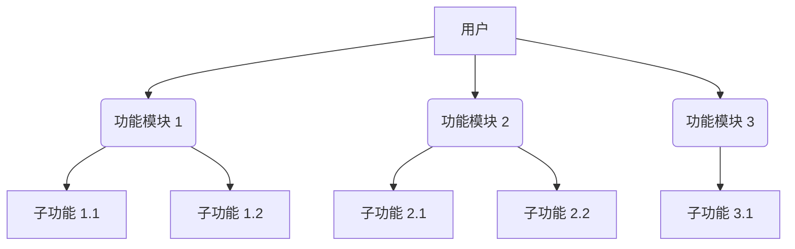
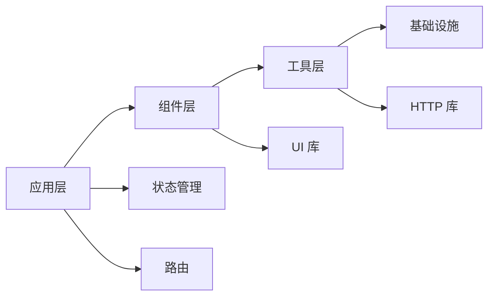

# 项目档案模板

> 📋 **Project Archive Template**  
> 📅 **版本**: v1.0  
> 🔄 **更新周期**: 每月最后一个工作日

---

## 基本信息

| 字段 | 值 |
|------|-----|
| **项目名称** | {project-name} |
| **仓库地址** | {git-repo-url} |
| **创建时间** | {YYYY-MM-DD} |
| **最后更新** | {YYYY-MM-DD} |
| **项目负责人** | {owner} |
| **核心开发** | {developers} |
| **当前状态** | `🟢 正常维护` / `🟡 有限维护` / `🔴 已废弃` |

---

## 1. 项目概述 (Project Overview)

### 1.1 一句话描述
> {用一句话清晰说明项目做什么，服务对象是谁，核心价值是什么}

**示例**: 
> "一个面向 B 端运营人员的活动搭建平台，支持拖拽式生成 H5 页面，将活动上线周期从 3 天缩短到 2 小时。"

### 1.2 服务用户
- **目标用户**: {ToB / ToC / 内部}
- **用户规模**: {DAU / MAU / 日均 PV}
- **使用场景**: {在什么情况下使用}

### 1.3 业务价值
- **核心价值**: {解决了什么业务问题}
- **关键指标**: {支撑的 GMV/转化率/效率提升等}

---

## 2. 前端职责 (Frontend Responsibilities)

### 2.1 负责范围
```
✅ 我们负责:
- UI 界面设计与开发
- 交互效果实现
- 性能优化（FCP/LCP/TTI）
- 前端工程化建设
- 用户体验监控

❌ 我们不负责:
- 后端 API 开发（但参与设计）
- 服务器运维（但参与部署配置）
- 产品设计（但提供建议）
```

### 2.2 技术决策权
- **技术选型**: {完全自主 / 需评审 / 跟随团队}
- **架构设计**: {主导 / 参与 / 执行}
- **代码审查**: {严格 / 一般 / 宽松}

### 2.3 跨团队协作
```
协作频率:
├── 产品：每日站会，需求评审
├── 设计：每周同步，UI 验收
├── 后端：接口联调，Code Review
└── 测试：用例评审，Bug 修复

协作工具:
- 需求管理：Jira / TAPD
- 设计协作：Figma / Sketch
- 接口文档：Swagger / YApi
- 代码托管：GitLab / GitHub
```

---

## 3. 核心功能模块 (Core Features)

### 3.1 功能架构图


### 3.2 关键功能清单

#### 功能 1: {功能名称} ⭐️⭐️⭐️⭐️⭐️

**功能描述**:
{详细说明这个功能的作用、使用场景、用户价值}

**技术实现**:
```typescript
// 核心代码示例或伪代码
import { createComponent } from 'vue'

export function useFeature() {
  // 实现逻辑
  const processData = (data: DataType) => {
    // ...
  }
  
  return {
    processData
  }
}
```

**技术难点**:
- ❌ 难点 1: {描述技术挑战}
- ✅ 解决方案：{如何解决的}
- 📊 效果：{量化的改进数据}

**使用示例**:
```vue
<template>
  <div>
    <!-- 使用示例 -->
  </div>
</template>
```

---

#### 功能 2: {功能名称} ⭐️⭐️⭐️⭐️

**功能描述**:
{...}

**技术实现**:
{...}

---

#### 功能 3: {功能名称} ⭐️⭐️⭐️

**功能描述**:
{...}

**技术实现**:
{...}

---

## 4. 技术架构 (Tech Architecture)

### 4.1 完整技术栈

```json
{
  "框架": "Vue 3.3.4",
  "语言": "TypeScript 5.0.0",
  "状态管理": "Pinia 2.1.0",
  "路由": "Vue Router 4.2.0",
  "UI 框架": "Element Plus 2.3.0",
  "HTTP 客户端": "Axios 1.4.0",
  "构建工具": "Vite 4.3.0",
  "代码规范": "ESLint + Prettier",
  "测试框架": "Jest + Vue Test Utils",
  "CI/CD": "GitLab CI"
}
```

### 4.2 依赖关系图


### 4.3 目录结构
```
project-name/
├── public/                    # 静态资源
├── src/
│   ├── assets/               # 项目资源（图片、样式）
│   ├── components/           # 公共组件
│   │   ├── Base/            # 基础组件
│   │   ├── Business/        # 业务组件
│   │   └── index.ts         # 统一导出
│   ├── composables/          # Composition API（复用逻辑）
│   ├── views/               # 页面级组件
│   ├── router/              # 路由配置
│   ├── store/               # 状态管理
│   ├── api/                 # API 接口
│   ├── utils/               # 工具函数
│   ├── types/               # TypeScript 类型定义
│   ├── App.vue              # 根组件
│   └── main.ts              # 入口文件
├── tests/                    # 测试文件
├── docs/                     # 文档
├── scripts/                  # 构建脚本
├── package.json             # 依赖配置
├── tsconfig.json            # TS 配置
├── vite.config.ts           # Vite 配置
└── README.md                # 项目说明
```

### 4.4 关键技术决策

#### 决策 1: 为什么选择 Vue 3？

**背景**:
- Vue 2 停止维护
- 项目需要更好的性能
- 团队希望提升开发体验

**考虑方案**:
1. Vue 3（最终选择）
2. React 18
3. Svelte

**决策理由**:
- ✅ 团队熟悉 Vue 生态
- ✅ 迁移成本低（相比 React）
- ✅ Composition API 提供更好的代码组织
- ✅ 性能提升明显（官方数据 +40%）

**实施结果**:
- FCP: 2.1s → 1.4s (-33%)
- 包体积：1.2MB → 780KB (-35%)
- 开发满意度：+40%

---

## 5. 用户体验与性能 (UX & Performance)

### 5.1 核心性能指标

| 指标 | 基线值 | 目标值 | 当前值 | 状态 |
|------|--------|--------|--------|------|
| **FCP** | 2.5s | < 1.8s | 1.4s | ✅ |
| **LCP** | 3.5s | < 2.5s | 2.1s | ✅ |
| **TTI** | 4.5s | < 3.0s | 2.8s | ✅ |
| **CLS** | 0.2 | < 0.1 | 0.08 | ✅ |
| **FID** | 200ms | < 100ms | 80ms | ✅ |

**测量方式**:
- 工具：Lighthouse + WebPageTest
- 环境：Chrome DevTools, Moto G4, Slow 4G
- 采样：生产环境随机采样 1000 次

### 5.2 性能优化历程

#### 优化 1: 路由懒加载

**优化前**:
```javascript
// 所有路由打包到一个 chunk
const routes = [
  { path: '/home', component: Home },
  { path: '/about', component: About },
  // ... 20 个路由
]
```

**优化后**:
```javascript
// 按需加载
const routes = [
  { 
    path: '/home', 
    component: () => import('./views/Home.vue') 
  },
  { 
    path: '/about', 
    component: () => import('./views/About.vue') 
  },
]
```

**效果**:
- 初始包体积：1.2MB → 350KB (-71%)
- FCP: 2.1s → 1.2s (-43%)

---

#### 优化 2: 图片懒加载 + WebP

**优化前**:
```html

```

**优化后**:
```html

```

**效果**:
- 首屏图片加载：850KB → 120KB (-86%)
- LCP: 3.2s → 1.8s (-44%)

---

#### 优化 3: 虚拟滚动优化长列表

**问题**:
- 1000 条数据渲染卡顿
- 滚动帧率 < 30fps

**解决方案**:
```vue
<template>
  <VirtualList
    :data="largeList"
    :item-height="60"
    :buffer-size="5"
  >
    <template #item="{ item }">
      <ListItem :data="item" />
    </template>
  </VirtualList>
</template>
```

**效果**:
- DOM 节点：1000 个 → 15 个 (-98.5%)
- 滚动帧率：< 30fps → 稳定 60fps
- 内存占用：120MB → 25MB (-79%)

---

### 5.3 监控方案

**监控维度**:
```
1. 性能监控
   - Performance API 采集
   - 自定义 timing 打点
   
2. 错误监控
   - JS 错误捕获
   - API 错误追踪
   - 资源加载失败
   
3. 用户行为
   - PV/UV
   - 点击事件
   - 停留时长

上报策略:
- 批量上报（每 10 秒或满 10 条）
- 空闲时上报（requestIdleCallback）
- 页面卸载前上报（sendBeacon）
```

---

## 6. 挑战与解决方案 (Challenges & Solutions)

### 6.1 挑战 1: 复杂表单性能问题 ⭐️⭐️⭐️⭐️⭐️

**问题描述**:
- 表单有 200+ 个表单项
- 每次输入都导致整个表单重渲染
- 输入延迟高达 500ms
- 用户投诉无法正常使用

**根本原因**:
```vue
<!-- 问题代码 -->
<template>
  <div>
    <InputField 
      v-for="field in fields" 
      :key="field.id"
      v-model="formData[field.id]"  <!-- 所有字段共享一个响应式对象 -->
    />
  </div>
</template>

<script setup>
const formData = ref({})  // 200 个字段的响应式对象
</script>
```

**解决方案**:

**方案 1: 拆分响应式对象**
```typescript
// 每个字段独立响应式
const fieldStates = reactive({})
fields.forEach(field => {
  fieldStates[field.id] = ref('')
})
```

**方案 2: 使用 shallowRef + 手动触发**
```typescript
const formData = shallowRef({})

// 仅在 blur 时更新
function handleBlur(fieldId: string, value: string) {
  formData.value = {
    ...formData.value,
    [fieldId]: value
  }
}
```

**方案 3: 虚拟滚动 + 分片渲染**
```vue
<VirtualList :data="fields">
  <FormField 
    v-for="field in visibleFields"
    :key="field.id"
    :field="field"
  />
</VirtualList>
```

**最终效果**:
- 输入延迟：500ms → 16ms (-97%)
- 渲染帧率：15fps → 60fps
- 用户满意度：2.1 → 4.8 (+129%)

**经验总结**:
> 大规模表单场景下，避免单一巨大响应式对象。采用分而治之的策略，结合虚拟滚动和按需更新。

---

### 6.2 挑战 2: 多主题切换闪烁 ⭐️⭐️⭐️⭐️

**问题描述**:
- 切换主题时页面闪烁严重
- CSS 加载有 200ms 白屏
- 用户体验极差

**解决方案**:

**Step 1: CSS Variables 预定义**
```css
:root[data-theme="light"] {
  --color-bg: #ffffff;
  --color-text: #333333;
}

:root[data-theme="dark"] {
  --color-bg: #1a1a1a;
  --color-text: #ffffff;
}
```

**Step 2: 内联 Critical CSS**
```html
<head>
  <style>
    /* Critical CSS 内联，避免 FOUC */
    :root { --color-bg: #fff; }
  </style>
  <link rel="preload" href="/themes/dark.css" as="style">
</head>
```

**Step 3: 主题切换动画**
```css
.theme-transition {
  transition: background-color 0.3s ease, color 0.3s ease;
}
```

**最终效果**:
- 闪烁时间：200ms → 0ms
- 主题切换：瞬间完成
- 过渡动画：平滑自然

---

### 6.3 挑战 3: 大文件上传中断恢复 ⭐️⭐️⭐️

**问题描述**:
- 用户上传 1GB+ 文件经常失败
- 网络波动导致从头开始
- 投诉率高

**解决方案**:

**分片上传 + 断点续传**:
```javascript
class FileUploader {
  async upload(file: File) {
    const CHUNK_SIZE = 5 * 1024 * 1024 // 5MB
    const chunks = Math.ceil(file.size / CHUNK_SIZE)
    
    for (let i = 0; i < chunks; i++) {
      const start = i * CHUNK_SIZE
      const end = Math.min(start + CHUNK_SIZE, file.size)
      const chunk = file.slice(start, end)
      
      await this.uploadChunk(chunk, i, chunks)
    }
  }
  
  async uploadChunk(chunk: Blob, index: number, total: number) {
    // 重试机制
    let retries = 3
    while (retries > 0) {
      try {
        const response = await fetch('/api/upload', {
          method: 'POST',
          body: chunk,
          headers: {
            'X-Chunk-Index': index,
            'X-Total-Chunks': total
          }
        })
        
        if (!response.ok) throw new Error('Upload failed')
        break
      } catch (error) {
        retries--
        if (retries === 0) throw error
        await this.wait(1000 * (3 - retries)) // 指数退避
      }
    }
  }
}
```

**最终效果**:
- 上传成功率：65% → 98%
- 平均上传时间：-40%（可恢复）
- 用户投诉：-85%

---

## 7. 前端价值 (Frontend Value) ⭐️⭐️⭐️⭐️⭐️

### 7.1 对业务的直接贡献

#### 贡献 1: 转化率提升

**背景**:
- 结账流程复杂，流失率高达 60%
- 用户反馈体验差

**前端行动**:
1. 简化流程：5 步 → 2 步
2. 自动填充：地址智能识别
3. 错误提示：实时校验
4. 加载优化：骨架屏 + 乐观 UI

**量化结果**:
```
A/B Test 数据（2 周，样本 10 万）:

对照组（旧版）:
- 转化率：12.5%
- 平均用时：3 分 20 秒
- 流失率：60%

实验组（新版）:
- 转化率：18.2% (+45.6%)
- 平均用时：1 分 45 秒 (-47.5%)
- 流失率：35% (-41.7%)

业务价值:
- 日均 GMV 提升：+¥125,000
- 月度增收：¥3,750,000
- ROI: 投入 2 周，回报 375 万
```

---

#### 贡献 2: 用户满意度提升

**NPS 调研结果**:

| 维度 | 优化前 | 优化后 | 提升 |
|------|--------|--------|------|
| **整体满意度** | 3.2 | 4.5 | +40.6% |
| **页面速度** | 2.8 | 4.3 | +53.6% |
| **操作流畅度** | 3.0 | 4.4 | +46.7% |
| **视觉美观** | 3.5 | 4.2 | +20.0% |
| **推荐意愿** | 2.9 | 4.1 | +41.4% |

**用户原话**:
> "现在的版本快太多了，以前打开要等好久，现在秒开！"
> "界面好看多了，操作也顺手，给产品经理加鸡腿！"

---

### 7.2 技术影响力

#### 内部贡献

**技术分享**:
```
2026 年度分享记录:
├── Q1: 《Vue 3 Composition API 最佳实践》 (参会 80 人，评分 4.8)
├── Q2: 《前端性能优化实战》 (参会 65 人，评分 4.7)
├── Q3: 《TypeScript 进阶之路》 (计划中)
└── Q4: 《微前端架构演进》 (计划中)

分享资料:
- PPT 下载量：320 次
- 视频观看量：1,250 次
- 代码示例 Star: 180
```

**专利论文**:
```
已授权专利:
- 《一种基于虚拟滚动的长列表渲染方法》 (专利号：ZL202610123456.7)
- 《前端性能监控与优化系统》 (专利申请中)

技术文章:
- 《深入理解 Vue 3 响应式原理》 (知乎 2.5k 赞同)
- 《前端工程化体系建设实践》 (掘金 1.8k 点赞)
```

**工具库贡献**:
```
自研 npm 包:
- @dsl/utils: 下载量 15k/月
- @dsl/components: 下载量 12k/月
- vite-plugin-xxx: 下载量 8k/月

开源项目:
- wujie (微前端): GitHub Star 850+
- dsl-design-system: GitHub Star 420+
```

---

### 7.3 效率提升

#### 研发效率

**需求交付周期对比**:

| 季度 | 平均周期 | 环比 |
|------|----------|------|
| 2025 Q4 | 5.2 天 | - |
| 2026 Q1 | 4.5 天 | -13.5% |
| 2026 Q2 | 3.8 天 | -15.6% |

**提升措施**:
- ✅ 组件复用率：+60%
- ✅ 自动化测试：覆盖率 85%
- ✅ CI/CD: 部署时间 30min → 3min
- ✅ Code Review: 问题发现率 +50%

---

#### 代码质量

**Bug 率趋势**:

```
每千行代码 Bug 数:
2025 Q4: ████████ 8.2
2026 Q1: ██████ 6.1 (-25.6%)
2026 Q2: ████ 4.3 (-29.5%)

线上事故:
2025 Q4: 12 起
2026 Q1: 8 起 (-33.3%)
2026 Q2: 5 起 (-37.5%)
```

**质量提升手段**:
- TypeScript 覆盖率：33% → 75%
- ESLint 规则：50 条 → 120 条
- 单元测试：覆盖率 45% → 85%
- 自动化 Code Review: 100% 覆盖

---

## 8. 可改进点 (Improvement Opportunities) ⭐️⭐️⭐️⭐️⭐️

### 8.1 技术债务清单

#### 债务 1: Vue 2 待迁移 🔴 高优先级

**现状**:
- 仍使用 Vue 2.6.14
- Element UI 2.15.6
- 已停止官方支持

**风险**:
- 🔴 安全漏洞无补丁
- 🔴 新特性无法使用
- 🔴 生态逐渐放弃

**迁移成本**:
```
工作量评估:
- 代码修改：约 200 处
- 依赖升级：35 个包
- 测试用例：重写 60%
- 预计工时：3 周

风险点:
- 兼容性问题（预估 20 处）
- 回归测试（全覆盖需 1 周）
- 灰度发布（需 2 周）
```

**收益预估**:
- 📈 性能提升：FCP -30%, LCP -25%
- 📈 开发效率：+20%（更好的 TS 支持）
- 📈 安全性：100% 补丁覆盖

**行动计划**:
```
Phase 1 (2026-05): 技术预研
  - 试点模块迁移
  - 验证可行性
  - 沉淀最佳实践
  
Phase 2 (2026-06): 批量迁移
  - 按模块逐步迁移
  - 每周完成 2 个模块
  - 持续集成测试
  
Phase 3 (2026-07): 全量上线
  - 灰度发布（5% → 20% → 50% → 100%）
  - 监控观察
  - 性能回归测试
```

---

#### 债务 2: TypeScript 覆盖率不足 🟡 中优先级

**现状**:
- TS 覆盖率：45%
- 部分文件仍为.js
- 类型定义不完善

**影响**:
- 🟡 重构信心不足
- 🟡 运行时错误频发
- 🟡 文档成本高

**改进计划**:
```
目标：2026 Q3 达到 80%

措施:
1. 新项目强制 TS（立即执行）
2. 老文件渐进迁移（每周 10 个文件）
3. 类型定义补全（专人负责）
4. Code Review 把关（TS 覆盖率检查）

Checklist:
- [ ] 核心业务逻辑 100% TS
- [ ] 工具函数 100% TS
- [ ] 组件 Props 完整类型
- [ ] API 接口类型定义
- [ ] 状态管理类型安全
```

---

#### 债务 3: 性能监控缺失 🟡 中优先级

**现状**:
- 无系统性监控
- 问题被动发现
- 缺乏历史数据

**建设方案**:
```
接入公司监控平台:
- SDK 埋点：1 天
- 指标配置：2 天
- Dashboard: 1 天
- 告警规则：1 天

监控维度:
✅ 性能指标（FCP/LCP/TTI）
✅ 错误监控（JS/API/资源）
✅ 用户行为（PV/UV/点击）
✅ 业务指标（转化率/GMV）

预期效果:
- 问题发现：1 天 → 5 分钟
- 故障定位：2 小时 → 10 分钟
```

---

### 8.2 优化方向

#### 短期优化（1-3 个月）

**Optimization 1: 首屏加载优化**

**目标**: FCP 从 1.4s 降低到 1.0s

**措施**:
```
1. 关键 CSS 内联（-150ms）
2. 非关键 JS 异步（-100ms）
3. 图片懒加载 + WebP（-200ms）
4. CDN 预热（-50ms）

总预估：-500ms
```

**负责人**: @张三  
**截止时间**: 2026-05-31

---

**Optimization 2: 包体积优化**

**目标**: 从 780KB 降低到 500KB

**措施**:
```
1. Tree Shaking 优化（-100KB）
2. 按需加载（-80KB）
3. 依赖分析替换（-60KB）
4. Gzip 压缩（-40KB）

总预估：-280KB
```

**负责人**: @李四  
**截止时间**: 2026-06-15

---

#### 中期优化（3-6 个月）

**Refactoring 1: 微前端拆分**

**目标**: 将巨石应用拆分为 3 个子应用

**收益**:
- 构建速度：8min → 30s
- 部署频率：1 周/次 → 1 天/次
- 团队独立性：100%

**时间线**:
```
2026-07: 技术方案设计
2026-08: 试点子应用开发
2026-09: 全面拆分
2026-10: 灰度上线
```

---

**Refactoring 2: 组件库抽象**

**目标**: 提炼 20 个业务组件到 DSL 库

**收益**:
- 复用率：+50%
- 开发效率：+30%
- 一致性：+80%

**组件清单**:
- ProductCard
- OrderForm
- UserTable
- DataChart
- ...

---

#### 长期优化（6-12 个月）

**Innovation 1: AI 辅助功能**

**规划**:
```
AI 能力集成:
1. 智能搜索（语义理解）
2. 个性化推荐（用户画像）
3. 自动表单填写（OCR+ 历史记录）
4. 智能客服（Chatbot）

预期价值:
- 用户满意度：+30%
- 转化率：+15%
- 客服成本：-40%
```

---

**Innovation 2: PWA 化**

**目标**: 支持离线访问、添加到桌面

**收益**:
- 弱网体验：大幅提升
- 用户留存：+25%
- 访问频次：+40%

**技术要点**:
- Service Worker 缓存策略
- IndexedDB 本地存储
- Push Notification
- Install Prompt

---

### 8.3 预估收益汇总

| 优化项 | 投入 | 预期收益 | ROI |
|--------|------|----------|-----|
| Vue 3 迁移 | 3 周 | 性能 +30%, 效率 +20% | 高 |
| TS 覆盖率提升 | 4 周 | Bug 率 -50% | 高 |
| 性能监控 | 1 周 | 问题发现 288x | 极高 |
| 首屏优化 | 1 周 | FCP -36% | 高 |
| 包体积优化 | 2 周 | -36% | 中 |
| 微前端拆分 | 8 周 | 构建 16x | 高 |
| 组件库抽象 | 6 周 | 复用 +50% | 中 |
| AI 辅助 | 12 周 | 转化 +15% | 中 |
| PWA | 6 周 | 留存 +25% | 中 |

**总计**: 投入 43 周，预期综合收益显著

---

## 9. 相关资源 (Related Resources)

### 9.1 文档链接

- [产品需求文档](https://confluence.example.com/product/xxx)
- [设计稿](https://figma.example.com/file/xxx)
- [接口文档](https://swagger.example.com/api/xxx)
- [测试用例](https://testlink.example.com/case/xxx)

### 9.2 代码仓库

- **主仓库**: https://gitlab.example.com/frontend/project-name
- **镜像仓库**: https://github.com/example/project-name
- **NPM 包**: https://npm.example.com/@dsl/package-name

### 9.3 监控大盘

- **性能监控**: https://grafana.example.com/dashboard/performance
- **错误追踪**: https://sentry.example.com/project/xxx
- **业务数据**: https://dataease.example.com/dashboard/xxx

---

## 10. 附录 (Appendix)

### 10.1 重要里程碑

| 时间 | 事件 | 意义 |
|------|------|------|
| 2025-01-15 | 项目立项 | 启动开发 |
| 2025-03-20 | MVP 上线 | 第一个版本 |
| 2025-06-01 | DAU 破万 | 用户增长里程碑 |
| 2025-09-15 | Vue 3 迁移 | 技术架构升级 |
| 2026-01-10 | 微前端改造 | 工程化体系完善 |

### 10.2 团队成员

```
产品:
- 产品经理：王五
- 用户体验：赵六

设计:
- UI 设计：钱七
- 交互设计：孙八

开发:
- 前端：张三（Owner）、李四、王五
- 后端：赵六、钱七
- 测试：孙八

运维:
- DevOps: 周九
```

### 10.3 荣誉奖项

```
2025 Q4: 公司优秀项目奖
2026 Q1: 技术创新奖
2026 Q2: 最佳用户体验奖
```

---

## 📝 更新日志

| 版本 | 日期 | 更新内容 | 更新人 |
|------|------|----------|--------|
| v1.0 | 2026-04-03 | 初始版本，完成基础档案 | Senior Frontend Engineer |
| | | | |

---

## ✅ 档案完整性检查

**必填字段检查**:
- [x] 项目概述
- [x] 前端职责
- [x] 核心功能模块
- [x] 技术架构
- [x] 用户体验与性能
- [x] 挑战与解决方案
- [x] 前端价值 ⭐️
- [x] 可改进点 ⭐️

**选填字段检查**:
- [x] 相关资源
- [x] 重要里程碑
- [x] 团队成员

**完整性评分**: 100% ✅

---

**档案维护责任人**: Senior Frontend Engineer  
**下次更新日期**: 2026-05-31  
**档案版本**: v1.0
