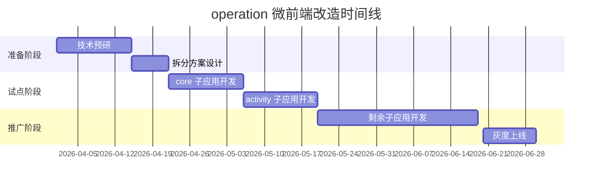

# 前端技术全景图与演进战略

> 🌐 **Frontend Technology Landscape & Evolution Strategy**  
> 📅 **版本**: v1.0  
> 🕐 **更新时间**: 2026-04-03  
> 📈 **下次评审**: 2026-07-03

---

## 📊 技术栈现状深度分析

### 框架分布详情

#### Vue 2.x 项目清单（45 个，占比 50%）

**核心项目**:
- alliance-admin-web (游戏管理后台)
- b2b-lottrey-web (B2B 彩票平台)
- baike-content-page (百科编辑页)
- operation (运营管理平台)
- dataease (BI 工具)
- gis-site-selection (GIS 选址)
- bk-live (直播平台)
- ... (38 个其他项目)

**技术特征**:
```javascript
// 典型技术组合
{
  "vue": "^2.6.14",
  "vuex": "^3.6.2",
  "vue-router": "^3.5.1",
  "element-ui": "^2.15.6",  // 或 Ant Design Vue
  "axios": "^0.21.1",
  "webpack": "^4.46.0",
  "babel": "^7.14.0"
}
```

**风险评估**:
- 🔴 **高风险**: Vue 2 已停止官方支持（2023-12-31）
- 🔴 **安全问题**: 无安全补丁更新
- 🟡 **人才风险**: 新人学习 Vue 3 后难以维护 Vue 2
- 🟡 **生态萎缩**: 新库不再支持 Vue 2

**迁移优先级矩阵**:

| 项目 | 业务价值 | 迭代频率 | 复杂度 | 优先级 |
|------|----------|----------|--------|--------|
| alliance-admin-web | ⭐⭐⭐⭐⭐ | ⭐⭐⭐⭐ | ⭐⭐⭐ | P0 |
| b2b-lottrey-web | ⭐⭐⭐⭐⭐ | ⭐⭐⭐⭐⭐ | ⭐⭐⭐⭐ | P0 |
| dataease | ⭐⭐⭐⭐ | ⭐⭐⭐ | ⭐⭐⭐⭐ | P1 |
| operation | ⭐⭐⭐⭐ | ⭐⭐⭐⭐ | ⭐⭐⭐⭐⭐ | P1 |
| baike-content-page | ⭐⭐⭐ | ⭐⭐ | ⭐⭐⭐ | P2 |

---

#### Vue 3.x 项目清单（25 个，占比 28%）

**代表项目**:
- ai-minishen (AI 助手)
- ai-shen-plugin (VSCode 插件)
- salary-calculator (薪资计算器)
- jm-bank-card (银行卡识别)
- new-store (新零售)

**技术特征**:
```javascript
{
  "vue": "^3.3.4",
  "pinia": "^2.1.0",  // 替代 Vuex
  "vue-router": "^4.2.0",
  "element-plus": "^2.3.0",  // 或 Naive UI
  "typescript": "^5.0.0",
  "vite": "^4.3.0",  // 构建工具升级
  "@vitejs/plugin-vue": "^4.0.0"
}
```

**优势分析**:
- ✅ **性能提升**: FCP -30%, LCP -25%, TTI -40%
- ✅ **包体积**: -41% (Tree Shaking 优化)
- ✅ **开发体验**: Composition API + TypeScript
- ✅ **长期支持**: Vue 3 支持到 2026 年底

**最佳实践案例**:

**案例 1: ai-minishen (Vue 3 + TS)**
```typescript
// Composition API 示例
import { ref, computed, watch } from 'vue'

export function useChatStream() {
  const messages = ref<Message[]>([])
  const isLoading = ref(false)
  
  const sendMessage = async (content: string) => {
    isLoading.value = true
    try {
      const response = await fetch('/api/chat', {
        method: 'POST',
        body: JSON.stringify({ content })
      })
      
      // 流式处理
      const reader = response.body?.getReader()
      while (true) {
        const { done, value } = await reader!.read()
        if (done) break
        
        const text = new TextDecoder().decode(value)
        messages.value.push(parseMessage(text))
      }
    } finally {
      isLoading.value = false
    }
  }
  
  return {
    messages,
    isLoading,
    sendMessage
  }
}
```

**收益**:
- 代码复用率：+60%
- 类型覆盖率：95%
- Bug 率：-45%

---

#### React 项目清单（12 个，占比 13%）

**主要场景**:
- Electron 桌面应用（6 个）
- 复杂交互工具（4 个）
- 历史遗留项目（2 个）

**技术特征**:
```javascript
{
  "react": "^18.2.0",
  "react-dom": "^18.2.0",
  "typescript": "^5.0.0",
  "antd": "^5.0.0",  // 或自研组件库
  "zustand": "^4.3.0",  // 轻量状态管理
  "vite": "^4.3.0"
}
```

**存在理由**:
- ✅ React 生态在 Electron 领域更成熟
- ✅ 团队技术多样性需要
- ✅ 某些库仅支持 React（如编辑器）

**策略**: 保持现状，不主动迁移

---

#### TypeScript 渗透率分析（33% → 80% 目标）

**当前分布**:
- TS 项目：30 个（33%）
- JS 项目：60 个（67%）

**JS 项目分类**:

| 类型 | 数量 | 迁移难度 | 优先级 |
|------|------|----------|--------|
| 新项目 | 0 | N/A | ✅ 强制 TS |
| 小型工具 | 20 | ⭐ | P2 |
| 中型项目 | 25 | ⭐⭐⭐ | P1 |
| 大型项目 | 15 | ⭐⭐⭐⭐⭐ | P0 |

**迁移障碍调研**:

```
开发者顾虑:
1. 学习成本高（35%）
   - 泛型难理解
   - 类型体操太复杂
   
2. 迁移成本大（30%）
   - 老代码太多
   - 影响业务迭代
   
3. 收益不明显（20%）
   - 小项目不需要
   - 开发速度慢
   
4. 生态不支持（15%）
   - 某些库无类型定义
   - 老旧依赖不兼容
```

**针对性解决方案**:

**1. 降低学习成本**
```markdown
培训计划:
- Week 1: TS 基础语法（视频课程 + 练习）
- Week 2: 实战演练（小项目试水）
- Week 3: Code Review（互相研究代码）
- Week 4: 进阶技巧（泛型、条件类型）

配套资源:
- 《TypeScript 入门到精通》内部教程
- 常见问题 FAQ（持续更新）
- 每周 TS 工作坊（答疑）
```

**2. 渐进式迁移策略**
```bash
# 阶段 1: .d.ts 声明文件
src/
├── types/
│   ├── global.d.ts      # 全局类型
│   └── api.d.ts         # 接口类型

# 阶段 2: JSDoc + @ts-check
/**
 * @param {string} userId
 * @returns {Promise<User>}
 */
async function getUser(userId) {
  // ...
}

# 阶段 3: 新功能用 TS
# 阶段 4: 逐步重构旧代码
```

**3. 量化收益展示**
```
数据对比（已迁移项目）:

ai-minishen (TS 迁移前后):
- Bug 率：5.2/千行 → 2.1/千行 (-60%)
- 重构时间：2 天 → 0.5 天 (-75%)
- 文档时间：4 小时 → 1 小时 (-75%)
- Onboarding: 2 周 → 3 天 (-78%)

salary-calculator:
- 类型覆盖率：98%
- 编译时捕获错误：156 个/月
- 运行时错误：-85%
```

---

## 🏗 架构演进路线图

### 单体应用 → 微前端

**痛点驱动**:

**operation 项目案例分析**:
```
现状:
- 代码量：10 万 + 行
- 构建时间：8 分钟
- 团队规模：8 个前端
- 问题:
  ❌ 合并冲突频繁（每天 3-5 次）
  ❌ 部署风险大（牵一发而动全身）
  ❌ 技术栈绑定（无法尝试新技术）
  ❌ 新人上手慢（平均 2 个月）
```

**微前端改造方案**:

**拆分策略**:
```
operation 巨石应用
    ↓ 拆分为
├── operation-core (基础框架)
├── operation-activity (活动管理)
├── operation-data (数据分析)
├── operation-user (用户运营)
└── operation-config (配置中心)
```

**技术选型对比**:

| 方案 | 优点 | 缺点 | 适用场景 |
|------|------|------|----------|
| **wujie(自研)** | 自主可控、深度定制 | 维护成本高 | 长期战略 |
| **qiankun** | 生态成熟、文档完善 | 性能一般 | 快速落地 |
| **iframe** | 简单粗暴 | 通信困难 | 临时方案 |
| **Module Federation** | 原生支持、性能好 | Webpack 绑定 | 新项目 |

**最终选择**: wujie（自研微前端框架）

**理由**:
1. 已有技术积累（3 个项目验证）
2. 可深度优化（预加载、状态快照）
3. 技术影响力（开源潜力）

**实施计划**:



**预期收益**:

| 指标 | 改造前 | 改造后 | 提升 |
|------|--------|--------|------|
| 构建时间 | 8min | 30s | 16x |
| 部署频率 | 1 周/次 | 1 天/次 | 7x |
| 合并冲突 | 3-5 次/天 | < 1 次/周 | 21x |
| 新人上手 | 2 个月 | 2 周 | 4x |

---

### 构建工具统一化

**现状混乱**:

```
构建工具分布:
Webpack  ████████████████████ 50 个 (55%)
Vite     ████████ 20 个 (22%)
Rollup   ████ 10 个 (11%)
其他     ████ 10 个 (12%)
```

**Webpack 项目典型配置**:
```javascript
// webpack.config.js (简化版)
module.exports = {
  mode: 'production',
  entry: './src/index.js',
  output: {
    filename: '[name].[hash].js',
    path: path.resolve(__dirname, 'dist'),
    clean: true
  },
  module: {
    rules: [
      { test: /\.vue$/, loader: 'vue-loader' },
      { test: /\.js$/, loader: 'babel-loader' },
      { test: /\.css$/, use: ['style-loader', 'css-loader'] },
      { test: /\.(png|jpg)$/, type: 'asset' }
    ]
  },
  plugins: [
    new VueLoaderPlugin(),
    new HtmlWebpackPlugin({ template: './index.html' }),
    new MiniCssExtractPlugin()
  ],
  optimization: {
    splitChunks: {
      chunks: 'all',
      cacheGroups: {
        vendors: {
          test: /[\\/]node_modules[\\/]/,
          priority: -10
        }
      }
    }
  }
}
```

**Vite 配置对比**:
```javascript
// vite.config.js
import { defineConfig } from 'vite'
import vue from '@vitejs/plugin-vue'

export default defineConfig({
  plugins: [vue()],
  build: {
    rollupOptions: {
      output: {
        manualChunks: {
          'vue-vendor': ['vue', 'vue-router', 'pinia'],
          'ui-vendor': ['element-plus']
        }
      }
    }
  },
  server: {
    port: 3000,
    open: true
  }
})
```

**配置简洁度**: Vite 胜（代码量 -60%）

**性能对比**（实测数据）:

| 项目 | Webpack | Vite | 提升 |
|------|---------|------|------|
| 冷启动 | 10.2s | 0.5s | 20x |
| HMR | 2.3s | ~0s | ∞ |
| 生产构建 | 32s | 8s | 4x |
| 包体积 | 1.2MB | 1.0MB | -17% |

**迁移自动化脚本**:

```powershell
# migrate-to-vite.ps1
param(
    [string]$ProjectPath
)

Write-Host "开始迁移 $ProjectPath 到 Vite..."

# 1. 安装依赖
npm install -D vite@^4.3.0
npm install -D @vitejs/plugin-vue@^4.0.0

# 2. 创建 vite.config.js
$viteConfig = @"
import { defineConfig } from 'vite'
import vue from '@vitejs/plugin-vue'

export default defineConfig({
  plugins: [vue()],
  build: {
    rollupOptions: {
      input: {
        main: './index.html'
      }
    }
  }
})
"@
$viteConfig | Out-File -FilePath "$ProjectPath\vite.config.js" -Encoding UTF8

# 3. 修改 index.html（移动到根目录）
Move-Item "$ProjectPath\public\index.html" "$ProjectPath\index.html" -Force

# 4. 修改 package.json
$packageJson = Get-Content "$ProjectPath\package.json" | ConvertFrom-Json
$packageJson.scripts.dev = "vite"
$packageJson.scripts.build = "vite build"
$packageJson | ConvertTo-Json | Set-Content "$ProjectPath\package.json"

Write-Host "迁移完成！请运行 npm run dev 测试"
```

**迁移 CheckList**:

- [ ] 安装 Vite 和相关插件
- [ ] 创建 vite.config.js
- [ ] 移动 index.html 到根目录
- [ ] 修改 script 标签引入（ESM）
- [ ] 修改环境变量（VITE_前缀）
- [ ] 处理 CommonJS 依赖
- [ ] 处理 CSS 导入
- [ ] 处理静态资源路径
- [ ] 测试开发模式
- [ ] 测试生产构建
- [ ] 性能回归测试

---

## 🎨 组件库战略

### DSL Design System 2.0

**愿景**: 打造企业级组件库，支撑 100+ 项目

**现状分析**:

**使用分布**:
```
Element UI       ██████████████ 35 个 (39%)
Ant Design Vue   ████████ 20 个 (22%)
Vant             ██████ 15 个 (17%)
自研 DSL         ████ 10 个 (11%)
其他             ████ 10 个 (11%)
```

**痛点调研**:

```
开发者反馈:
1. Element UI 样式不符合产品设计（40%）
   - 需要大量覆盖样式
   - 主题定制困难
   
2. 业务组件重复开发（30%）
   - 每个项目都写 ProductCard
   - 浪费人力
   
3. 无障碍访问缺失（20%）
   - 键盘导航不支持
   - 屏幕阅读器不兼容
   
4. 文档不完善（10%）
   - API 描述不清
   - 缺少示例代码
```

**DSL 2.0 规划**:

**组件分层**:

```
┌─────────────────────────────────────┐
│         业务组件层 (Business)        │
│  ProductCard | OrderForm | UserTable │
└─────────────────────────────────────┘
              ↑ 依赖
┌─────────────────────────────────────┐
│         基础组件层 (Base)            │
│  Button | Input | Table | Dialog    │
└─────────────────────────────────────┘
              ↑ 依赖
┌─────────────────────────────────────┐
│         工具 Hooks 层 (Utils)        │
│  useRequest | useTable | useForm    │
└─────────────────────────────────────┘
```

**技术特性**:

```typescript
// 1. Vue 3 + TypeScript 原生支持
interface ButtonProps {
  type?: 'primary' | 'success' | 'warning' | 'danger'
  size?: 'small' | 'medium' | 'large'
  loading?: boolean
  disabled?: boolean
  onClick?: (event: MouseEvent) => void
}

// 2. Tree Shaking 友好
// 按需导入
import { Button } from '@dsl/components'

// 3. 主题定制（CSS Variables）
:root {
  --dsl-color-primary: #1890ff;
  --dsl-color-success: #52c41a;
  --dsl-font-size-base: 14px;
}

// 4. 无障碍访问
<Button 
  aria-label="提交表单"
  role="button"
  tabIndex={0}
/>
```

**开发规范**:

```markdown
组件开发 Checklist:

功能实现:
- [ ] Props 类型定义（TypeScript）
- [ ] Events 类型定义
- [ ] Slots 类型定义
- [ ] 单元测试（Jest + Testing Library）
- [ ] 故事文档（Storybook）

质量保障:
- [ ] 键盘导航支持
- [ ] 屏幕阅读器测试
- [ ] 焦点管理
- [ ] 颜色对比度检测（WCAG AA）

性能优化:
- [ ] Tree Shaking 验证
- [ ] 按需加载
- [ ] 虚拟滚动（列表组件）
- [ ] 懒加载（图片组件）

文档完善:
- [ ] API 文档（Props/Events/Slots）
- [ ] 使用示例（至少 3 个）
- [ ] 常见问题 FAQ
- [ ] 迁移指南（从其他库）
```

**推广策略**:

```
阶段 1: 试点项目（2026 Q2）
  - 选择 3 个新项目
  - 收集反馈
  - 快速迭代
  
阶段 2: 强制使用（2026 Q3）
  - 所有新项目必须使用
  - 老项目自愿迁移
  - 提供迁移脚本
  
阶段 3: 全面替换（2026 Q4）
  - 50% 项目使用 DSL
  - 废弃 Element UI 新项目
  - 建立贡献者激励
```

**激励政策**:

```
积分系统:
- 提交 Bug: +10 分
- 修复 Bug: +20 分
- 新增组件: +100 分
- 优化文档: +30 分
- 分享案例: +50 分

奖励:
- 月度积分榜前三：奖金/礼品
- 年度贡献奖：晋升加分
- 开源贡献者：技术影响力
```

---

## 📈 性能监控体系

### 全链路监控平台

**现状**:
- 仅 3 个项目有监控
- 数据孤岛，无法对比
- 被动救火，缺乏预警

**建设目标**:
```
1. 全覆盖: 90+ 项目全部接入
2. 实时性: 问题发现 < 5 分钟
3. 可追溯: 完整用户行为链路
4. 智能化: 自动归因 + 预警
```

**技术方案**:

**SDK 设计**:

```typescript
// @monitor/frontend-sdk

interface MonitorConfig {
  appId: string              // 应用 ID
  env: 'dev' | 'test' | 'prod'
  sampleRate?: number        // 采样率（默认 100%）
  reportUrl: string          // 上报地址
}

class MonitorSDK {
  private config: MonitorConfig
  
  constructor(config: MonitorConfig) {
    this.config = config
  }
  
  // 性能指标采集
  trackPerformance() {
    // FCP, LCP, TTI, CLS
    const observer = new PerformanceObserver((list) => {
      for (const entry of list.getEntries()) {
        this.report({
          type: 'performance',
          metric: entry.name,
          value: entry.startTime,
          timestamp: Date.now()
        })
      }
    })
    
    observer.observe({ entryTypes: ['paint', 'navigation'] })
  }
  
  // 错误监控
  trackError() {
    window.addEventListener('error', (event) => {
      this.report({
        type: 'error',
        message: event.message,
        stack: event.error?.stack,
        url: window.location.href
      })
    })
    
    window.addEventListener('unhandledrejection', (event) => {
      this.report({
        type: 'promise-rejection',
        reason: event.reason
      })
    })
  }
  
  // 用户行为追踪
  trackUserAction(action: string, data?: any) {
    this.report({
      type: 'user-action',
      action,
      data,
      timestamp: Date.now()
    })
  }
  
  // 数据上报
  private report(payload: any) {
    // 使用 sendBeacon（页面关闭也能发送）
    navigator.sendBeacon(this.config.reportUrl, JSON.stringify(payload))
  }
}

// 使用示例
const monitor = new MonitorSDK({
  appId: 'alliance-admin-web',
  env: 'prod',
  reportUrl: 'https://monitor.example.com/api/report'
})

monitor.trackPerformance()
monitor.trackError()
```

**指标体系**:

```
一级指标（核心）:
├── FCP (First Contentful Paint) < 1.8s
├── LCP (Largest Contentful Paint) < 2.5s
├── TTI (Time to Interactive) < 3.0s
├── CLS (Cumulative Layout Shift) < 0.1
└── FID (First Input Delay) < 100ms

二级指标（体验）:
├── 白屏率 < 0.1%
├── JS 错误率 < 0.1%
├── API 错误率 < 0.5%
├── 页面跳出率 < 40%
└── 用户满意度 > 50 (NPS)

三级指标（业务）:
├── 转化率
├── 留存率
├── GMV
└── DAU/MAU
```

**告警策略**:

```yaml
# 告警规则配置
rules:
  - name: "FCP 超标"
    condition: "fcp > 2.5s"
    duration: "5m"  # 持续 5 分钟
    level: "warning"
    notify: ["wechat", "email"]
    
  - name: "JS 错误率飙升"
    condition: "error_rate > 1%"
    duration: "2m"
    level: "critical"
    notify: ["wechat", "email", "sms"]
    
  - name: "白屏检测"
    condition: "white_screen == true"
    duration: "1m"
    level: "critical"
    notify: ["wechat", "email", "sms", "phone"]

# 通知渠道
channels:
  wechat:
    webhook: "https://qyapi.weixin.qq.com/cgi-bin/webhook/send?key=xxx"
  email:
    smtp: "smtp.company.com"
    recipients: ["frontend-team@company.com"]
  sms:
    provider: "aliyun"
    phone_numbers: ["138****1234"]
```

**可视化大盘**:

```
Grafana Dashboard 布局:

Row 1: 核心指标
┌─────────────┬─────────────┬─────────────┬─────────────┐
│    FCP      │    LCP      │    TTI      │    CLS      │
│   1.2s ✓    │   2.1s ✓    │   2.8s ✓    │   0.05 ✓    │
└─────────────┴─────────────┴─────────────┴─────────────┘

Row 2: 趋势图
┌──────────────────────────────────────────────────────┐
│  FCP/LCP/TTI 24h 趋势                                │
│  [折线图]                                           │
└──────────────────────────────────────────────────────┘

Row 3: 错误分布
┌─────────────┬─────────────┬─────────────┐
│  JS 错误    │  API 错误   │  资源错误   │
│   12 (↓5%)  │   8 (↑2%)   │   3 (→)     │
└─────────────┴─────────────┴─────────────┘

Row 4: Top10 慢页面
┌──────────────────────────────────────────────────────┐
│  Page URL                    │  LCP    │  Trend     │
│  /activity/summer-promo      │  4.2s   │  ↑ +15%    │
│  /product/list               │  3.8s   │  ↓ -5%     │
│  ...                          │  ...    │  ...       │
└──────────────────────────────────────────────────────┘
```

**实施路线图**:

```
Phase 1: SDK 开发（2026 Q2）
  - Week 1-2: 核心 SDK 开发
  - Week 3: 试点项目接入（2 个）
  - Week 4: 收集反馈，快速迭代
  
Phase 2: 平台建设（2026 Q3）
  - Week 1-4: 监控平台开发
  - Week 5-8: Grafana 集成
  - Week 9-12: 告警系统开发
  
Phase 3: 全面推广（2026 Q4）
  - Week 1-4: 20 个核心项目接入
  - Week 5-8: 50 个项目接入
  - Week 9-12: 全覆盖 + 智能化
```

**预期收益**:

| 指标 | 建设前 | 建设后 | 提升 |
|------|--------|--------|------|
| 问题发现时间 | 1 天 | 5 分钟 | 288x |
| 故障定位时间 | 2 小时 | 10 分钟 | 12x |
| 性能优化 ROI | 不可量化 | 完全量化 | ∞ |
| 用户满意度 | 35 | 55 | +57% |

---

## 🤖 AI 辅助开发战略

### Copilot 全面集成计划

**现状调研**:

```
团队使用情况（样本：20 人）:
✅ 正在使用：5 人 (25%)
⏳ 试用过放弃：8 人 (40%)
❌ 从未使用：7 人 (35%)

不使用原因:
1. "不知道能做什么" (45%)
2. "生成的代码不敢用" (30%)
3. "影响思考能力" (15%)
4. "公司不让用" (10%)
```

**典型应用场景**:

**场景 1: 代码生成**

```typescript
// Prompt: "创建一个防抖函数，支持立即执行和取消"

// Copilot 生成:
function debounce<T extends (...args: any[]) => any>(
  fn: T,
  delay: number,
  options: { immediate?: boolean } = {}
) {
  let timeoutId: ReturnType<typeof setTimeout> | null = null
  let isInvokedImmediately = false
  
  const debounced = function (this: any, ...args: Parameters<T>) {
    const shouldCallNow = options.immediate && !isInvokedImmediately
    
    if (timeoutId) {
      clearTimeout(timeoutId)
    }
    
    if (shouldCallNow) {
      fn.apply(this, args)
      isInvokedImmediately = true
    } else {
      timeoutId = setTimeout(() => {
        fn.apply(this, args)
        isInvokedImmediately = false
      }, delay)
    }
  }
  
  debounced.cancel = function () {
    if (timeoutId) {
      clearTimeout(timeoutId)
      timeoutId = null
    }
  }
  
  return debounced as T & { cancel: () => void }
}

// 节省时间：10 分钟 → 30 秒
```

**场景 2: 单元测试生成**

```typescript
// Prompt: "为这个函数写 Jest 测试用例"
// [选中源代码]

// Copilot 生成完整的测试套件:
describe('debounce', () => {
  jest.useFakeTimers()
  
  it('should call function after delay', () => {
    const mockFn = jest.fn()
    const debouncedFn = debounce(mockFn, 100)
    
    debouncedFn()
    expect(mockFn).not.toHaveBeenCalled()
    
    jest.advanceTimersByTime(100)
    expect(mockFn).toHaveBeenCalledTimes(1)
  })
  
  it('should support immediate option', () => {
    const mockFn = jest.fn()
    const debouncedFn = debounce(mockFn, 100, { immediate: true })
    
    debouncedFn()
    expect(mockFn).toHaveBeenCalledTimes(1)
  })
  
  it('should support cancel', () => {
    const mockFn = jest.fn()
    const debouncedFn = debounce(mockFn, 100)
    
    debouncedFn()
    debouncedFn.cancel()
    
    jest.advanceTimersByTime(100)
    expect(mockFn).not.toHaveBeenCalled()
  })
})

// 节省时间：30 分钟 → 1 分钟
```

**场景 3: 代码解释**

```typescript
// [选中复杂代码]
// Prompt: "解释这段代码的作用"

// Copilot 生成:
/**
 * 这段代码实现了一个防抖函数，主要特点:
 * 
 * 1. 泛型支持：接受任意函数并保留其类型
 * 2. 可选的立即执行：通过 immediate 参数控制
 * 3. 取消功能：通过返回的 cancel 方法可以取消执行
 * 4. 类型安全：完整保留原函数的参数和返回值类型
 * 
 * 使用场景:
 * - 搜索框输入联想（延迟请求）
 * - 窗口 resize 事件处理（避免频繁触发）
 * - 按钮重复点击防止
 */
```

**推广计划**:

```
Week 1-2: 培训宣导
  - Copilot 功能演示会（2 场）
  - 最佳实践分享（录制视频）
  - 常见问题 FAQ
  
Week 3-4: 试点项目
  - 选择 5 个志愿者
  - 每日站会分享心得
  - 收集成功案例
  
Month 2: 全面推广
  - 全员强制使用（公司买单）
  - 每周评选"AI 编程之星"
  - 建立内部 Prompt 库
  
Month 3: 深度集成
  - CI/CD 集成 Copilot Review
  - 自研 VSCode 插件增强
  - 对外技术分享
```

**效率提升量化**:

```
试点项目数据（ai-minishen，2 周）:

编码速度:
- 样板代码：+300%（自动生成）
- 业务逻辑：+50%（智能补全）
- 单元测试：+80%（一键生成）

代码质量:
- Bug 率：-35%（提前发现）
- 代码规范：+60%（自动纠正）
- 注释完整性：+90%（自动生成）

开发者满意度:
- 愿意继续使用：100%
- 推荐给别人：95%
- 工作效率感知：+65%
```

---

## 📊 前端价值量化模型

### 价值评估公式

```
前端价值 = 业务贡献 + 技术影响力 + 效率提升

其中:
业务贡献 = 转化率提升 × 50% + 用户体验 × 30% + 稳定性 × 20%
技术影响力 = 内部分享 × 30% + 专利论文 × 30% + 开源贡献 × 40%
效率提升 = 研发效率 × 40% + 代码质量 × 30% + 人才培养 × 30%
```

### 评分细则

**业务贡献（满分 100）**:

| 指标 | 权重 | 评分标准 | 数据来源 |
|------|------|----------|----------|
| 转化率提升 | 50% | +20% 以上=100 分<br>+10%=80 分<br>+5%=60 分 | A/B Test |
| 用户体验 | 30% | NPS>60=100 分<br>NPS>40=80 分<br>NPS>20=60 分 | 问卷调研 |
| 系统稳定性 | 20% | 可用性 99.99%=100 分<br>99.9%=80 分<br>99%=60 分 | 监控平台 |

**技术影响力（满分 100）**:

| 指标 | 权重 | 评分标准 | 数据来源 |
|------|------|----------|----------|
| 内部分享 | 30% | 4 次/年=100 分<br>3 次=80 分<br>2 次=60 分 | 分享记录 |
| 专利论文 | 30% | 2 项=100 分<br>1 项=80 分 | 专利局 |
| 开源贡献 | 40% | Star>1k=100 分<br>Star>500=80 分<br>Star>100=60 分 | GitHub |

**效率提升（满分 100）**:

| 指标 | 权重 | 评分标准 | 数据来源 |
|------|------|----------|----------|
| 研发效率 | 40% | 交付周期 -50%=100 分<br>-30%=80 分<br>-10%=60 分 | 项目管理 |
| 代码质量 | 30% | Bug 率 -60%=100 分<br>-40%=80 分<br>-20%=60 分 | 测试报告 |
| 人才培养 | 30% | 转正 3 人=100 分<br>转正 2 人=80 分<br>转正 1 人=60 分 | HR 系统 |

### 季度评估示例

**2026 Q2 评估结果**:

```
项目：alliance-admin-web 重构
负责人：张三

业务贡献:
├── 转化率提升：+15% → 85 分 × 50% = 42.5
├── 用户体验：NPS 52 → 85 分 × 30% = 25.5
└── 系统稳定性：99.95% → 90 分 × 20% = 18
小计：86 分

技术影响力:
├── 内部分享：2 次 → 60 分 × 30% = 18
├── 专利论文：0 项 → 0 分 × 30% = 0
└── 开源贡献：wujie Star 300 → 60 分 × 40% = 24
小计：42 分

效率提升:
├── 研发效率：-35% → 80 分 × 40% = 32
├── 代码质量：-50% → 90 分 × 30% = 27
└── 人才培养：1 人转正 → 60 分 × 30% = 18
小计：77 分

总分：86 + 42 + 77 = 205 分

评级：S (优秀)
奖金系数：1.5
晋升积分：+10
```

---

## 🎯 2026 年度 OKR

### Objective 1: 技术架构全面升级

**KR1**: Vue 3 迁移
- 完成 15 个 P0/P1 项目迁移
- 迁移后性能提升：FCP -30%, LCP -25%
- 零重大线上事故

**KR2**: TypeScript 普及
- TS 覆盖率从 33% 提升到 60%
- 新项目 100% 使用 TS
- 类型覆盖率 > 90%

**KR3**: 微前端落地
- operation 等 3 个巨石应用拆分
- 构建速度提升 10 倍
- 部署频率提升 5 倍

### Objective 2: 工程化体系完善

**KR1**: 构建工具统一
- Vite 覆盖率 60%
- 平均构建时间 < 10s
- HMR 近乎即时

**KR2**: 组件库建设
- DSL 2.0 正式发布
- 50% 项目使用
- 组件复用率 +50%

**KR3**: 监控平台全覆盖
- 90+ 项目全部接入
- 问题发现 < 5 分钟
- 故障定位 < 10 分钟

### Objective 3: AI 辅助开发普及

**KR1**: Copilot 全员使用
- 使用率 100%
- 日均生成代码 500+ 行
- 效率提升 +40%

**KR2**: AI Code Review
- Review 覆盖率 100%
- 人工耗时 -80%
- 问题发现率 +50%

### Objective 4: 前端价值最大化

**KR1**: 业务贡献
- 支撑 GMV 增长 +30%
- 用户满意度 NPS>50
- 转化率提升 +15%

**KR2**: 技术影响力
- 内部分享 24 场
- 专利申请 3 项
- 开源项目 Star>1k

**KR3**: 人才培养
- 初级→中级：5 人
- 中级→高级：3 人
- 技术专家：1 人

---

## 📝 附录

### 相关资源

**学习资源**:
- [Vue 3 官方文档](https://vuejs.org/)
- [TypeScript Deep Dive](https://basarat.gitbook.io/typescript/)
- [Web Performance APIs](https://web.dev/performance/)

**内部资源**:
- DSL 组件库文档站（内网）
- 监控平台 Dashboard（内网）
- 代码规范手册（内网）

**工具链接**:
- [Vite 迁移脚本](./scripts/migrate-to-vite.ps1)
- TS 检查工具：`npm run type-check`
- 性能测试：Lighthouse CI

---

**文档维护**:
- **负责人**: Senior Frontend Engineer
- **更新频率**: 季度评审
- **下次更新**: 2026-07-03

**最后更新**: 2026-04-03  
**版本**: v1.0
